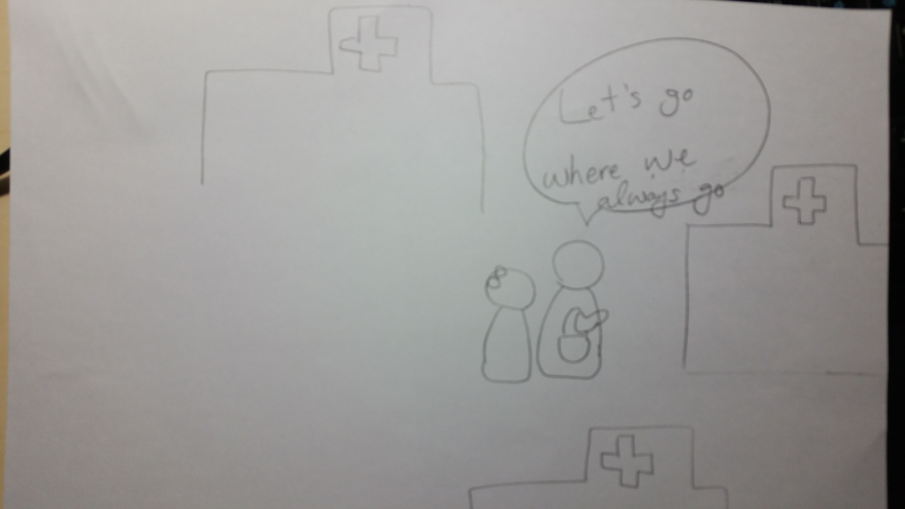

# Human Computer Interaction

##DP 1: Need Finding

	<h4>TEAM: Oh-Hack-Nyun
    	<h6>Hyeongcheol Moon
        	Minyeong Yang
        	Seunghee Yoon
        	Taesoo Lim</h6>
    </h4>

####***[Experience]***
The idea that we are proudly pronouncing for our semester-long design project has come across from rather general experience which most people might had suffered more than once in their lifetime. You probably went through an experience that you realized a few unsolved questions in your mind regarding your treatments or prescription right after you left hospital. You may went back, but encountered with a large number of patients staying in line while doctor only stayed-still in his office. You may had contemplated, but soon thereafter, you would renounce and remained anxious until the next checkup. One of our team member also had an experience of regular treatment including series of unfamiliar procedures in a dermatology clinic. He recalled that the cure he had experienced, embodied potential side-effects so he wanted to ask questions in each maintenance period between procedures. However, it was not surprising that it was rather annoying for him to do, since most hospitals only allow patients to raise inquiries through phone calls.
Unlike doctors and all the other parties concerned, patients in many cases had never tried those unseen treatments thereby relatively simple surgeries or procedures could lead to huge stress for them. In some extreme cases, patient might do what they should never do during recovery periods. Regarding patients’ circumstance, the current system of medical checkup lacks vibrant communication with each patient because the one has to depend on a paid, “face-to-face” checkup which is held out within a very short amount of reserved time.
The inconvenience due to communication shortage is not only confined to the situation when patients raise their questions. Generally, doctor demonstrates how the previous symptom has been relieved by showing “before and after” pictures, which can either be obtained from digital camera or medical equipments such as x-ray machines, CT and MRI. The problem is, those pictures are shown but not normally distributed although they contain rather important information about each patient. Therefore as time passes, it’s hard for patients to remember the the level of effectiveness of certain treatment and his/her past condition regarding the symptom and treatment. Also, there’s cases when we want to figure out questions like, ‘When did i go to hospital?’ or ‘How many times have i gone to that hospital?’ or even, ‘How long have I been visiting that hospital?’. This also can not easily be resolved unless we explicitly (call or visit to) ask and then wait for the answers to be replied.
After team discussing, we thought that the experiences we had underwent could only be partially reflecting real life so there are more needs and affairs for both patients and doctors in terms of communicating. we set out initial goal as

	to redesign an interface for patients to communicate, be informed and easily provoke inquiries to   doctor and an interface for hospital to service real-time communication and collect patients’ 	  information to get knowledge about patients.
Our observations and the result of interviews as well as derived needs and insights follow, and what comes next will sufficiently explain why our team has established the above goal.

  
####***[Observations & Interviews]***

Thus, participants of our design project would be patients and hospital. Out of those candidates, we decided to primarily focus on dermatological hospital. The reason to narrow down our target user population is because we thought the user-interface in our current conception would fit the best for patients who go to hospital frequently and in a regular basis. Hospital is our target user as well, but doctors who want to communicate a lot with their clients are more preferable.

**24 years old, SRT train crew** - interviewed by HyeongCheol Moon

:She goes to dermatological hospital frequently to get medical care for her sensitive skin. 

Interesting Moments

- There are quite a lot of women going to dermatological hospital in a regular basis
- The price of medical treatment is more expensive than she thought
- Dermatological hospitals in these days take care of providing services very much
- People have different skin, and sometimes people should be aware of some medical ingredients that they should not use.

**23 years old student in KAIST** - interviewed by Taesoo Lim

: She doesn’t go to dermatological hospital regularly. She went to dermatological hospital before she got into college to get rid of moles, and that was the last time.

Intersting Moments

- She went to dermatological hospital that her mother goes consistently.
- Her mother made reservation beforehand, and she went to the hospital at the designated date.
- It was somewhat uncomfortable to talk a lot with doctor after the treatment, since it feels like she is taking office time of doctor.

  
**Dermatological Doctor** - interviewed(..?) by SeungHee Yoon
It was tough to be succeeded by email, but Seunghee Yoon has finally conducted an interview with Dr. Kim Sangeun who manages a dermatology clinic named ‘연세OO피부과’ in Nogosan-dong, Mapo-gu, Seoul.
Some important ‘figure-out’s are listed below.

Note that Dr. Kim tries to communicate actively online. He is running his own blog in order to introduce medical informations, getting questions in naver cafes where he invites inquiries from any patients whether they had been to his hospital or not. He’s also opening his email account that anyone can ask either personal or individual questions.
Thus we asked whether there is any inconvenience for him to communicate with patients. For that question, he replied that the most challenging thing is the fact that he has to guess patient’s current situation by patient’s textual explanation. But he thinks it can’t be helped.
And as we asked the reason why he invite inquiries from unspecified individuals, he mentioned that he was embarrassed viewing faulty consults in Internet mostly due to promotional purpose. Thus he said he is trying to impart innocent, objective and correct information to patients with a sense of his duty. He also thinks those acts seem to be good for improving reliability.
But in general, Dr. Kim does not think every doctor can openly be committed to the answering free questions. According to him, it is somewhat ambiguous to classify those answering affair to ‘treatment’ or not. If so, it has to be associated with the “charge” for medical treatment as well as with the proper responsibility for those words. 
Then, we were curious about how Dr. Kim could handle all those time-consuming answerings and communications. What he said was roughly alike to dictionary or indexing which is common in computer science field that he told us he has detailedly categorized his questions so he can pick one of the appropriate from that categorization.
Lastly, we asked him whether there is any computing needs for manipulating clients’ data. He said he had tried that before but he couldn’t apply that to any further usage. He now thinks it’s important to check patient’s facial condition individually and then compose treatment set with considerations of personal circumstances.
Overall, he said he thinks such service can increase user convenience but is important to consider legal issues if the service extends over the area of treatment.

Interesting Points:

- Dr. Kim has concerned a lot in order to actively communicate with patients but in rather inefficient way when computing major students think of it.
- Dr. Kim did not really speak up what he now needs but mentioned that it’s little hard to judge one’s condition by reading patient’s textual explanation.
- Dr. Kim couldn’t pick up meaningful knowledge from patients’ information but he tried to.

  
**Survey Result** - taken by Minyeong Yang

<em>How often do you go to dermatological hospital?</em>
<em>Do you go to certain dermatological hospital consistently?</em>

The diagram on the left is the result for the survey question "How often do you go to dermatological hospital?", in the scale of one to five. The diagram right is the result for "Do you go to certain dermatological  hospital consistently?". One interesting result shown in the left diagram is that there are plenty of users who chose "1" for the frequency of visiting hospital. It seemed the leant result shown on the left is because about half of the voters are from KAIST. The other half fortunately come up with various results.
The graph on the right proposes the results that most voters go to the certain hospital consistently, rather than just going the closest or randomly chosen. This result is somewhat attractive in the sense that there were plenty of people who don't go to dermatological hospital still go to familiar hospital.

<em>Is there any inconvenience in checking schedule (appointment) with the hospital?</em>

This diagram above is the survey result for the question right above, scale from one to five. In fact, it was not expected that the result turned out as a sizable portion of people don’t really feel inconvenience in checking their hospital schedule. However, it is thoughtfully acceptable that hospital appointment is one of many schedules that we always plan and finish.

<em>How do you receive the result of medical treatment from the hospital?</em>
<em>Is there any way that you can check the medical progress for the treatment?</em>

The diagram left is the graphical result of the survey question “How do you receive the result of medical treatment from the hospital?”. The first choice which got the most votes is “in verbal”. There are some other choices like “in paper”, or “via online”, but most of users received their result in oral statement. The diagram right is the survey result for another question “Is there any way that you can check the medical progress for the treatment?”. The first choice is “by visiting the hospital”. Thus, it is possible to conclude that patients will receive the progress in the same way with how they received the result of the treatment.

  
**Interesting Points**

Survey is not interactive action so that we would rather call this step as “Interesting points” than “interesting moments”. 

- Most people go to the certain familiar dermatological hospital consistently, regardless of their frequency of going to dermatological hospital
- Patients mostly receive their result or medical report of the treatment in verbal
- Patients should visit or contact to get their medical reports or medical progresses

  
####***[Needs]***

Finalized “Needs” from all interesting moments and points:

- Patients want to
	- ask questions more easily.
	- have a specific schedule for treatments.
	- know the information of hospital or doctor like location, office hours, etc.
	- see the progress of their medical treatments whenever they want.
	- be informed of some events like a discount by the hospital.

- Doctors or Hospitals want to
	- manage their patients easily.
	- communicate with patients quickly and easily such as Q&A.
	- give patients the promotions they do.
	- collect and visualize the data of patients.

In the viewpoint of patients, most of their needs are, in fact, possible to be done already now, but they want to do all tasks “easily”. In doctor’s point of view, they don’t have enough time to fulfill all the requests from patients.

  
####***[Insights]***
Through interviews and surveys, we found the following insights.

***Regarding patients***,

- There is no way to check their medical progress other than actually visiting the hospital.

	`In most cases, the medical progress is often not thought to be needed by the patient, and many people don't know it unless they ask the doctor directly. In our survey, more than 80% visit the hospital if they want to check their medical progress.`

- We found some people who wants to check and update their scheduled appointments easily.

	`There are very few other ways to make hospital appointments, either directly or by telephone.`

- Patients always have to find office hour or location of hospital through Internet or calling.

	`Many hospitals have different office hours. Since lunch time and nighttime treatment differ from hospital to hospital, we should look for it every time.`

- Before patients visit the hospital, they want to know possible waiting time based on how crowded the hospital is.

	`The number of patients visiting the hospital is irregular. They often wait more than an hour in busy times, so we found that there is a need for a way to know the waiting time in advance before going to the hospital.`

- Patients may want to know about the price of each medical treatment.

	`Asking Medical expenses is difficult before finishing treatments. It is usually uncomfortable to ask the doctor about the price.`

- It turned out that most patients are going to certain hospital consistently, which implies that they are interested in the information of the one hospital they are actually going to.

	`In our survey, about 90% of people visit hospitals they have visited before. Once someone first visit a hospital, information about other hospitals is unnecessary.`

And
***Regarding hospitals***,

- Because of the current legal issue, answering a question raised by patient comes under medical treatment.

	`The questions from patients must be answered by doctors.`

- The one who deals with patients’ questions must be doctor.

	`There are many nurses in the hospital, but only one doctor has the expertise to answer the patients' questions. So, it is difficult to take all the questions alone.`
    
- There’s not enough time for doctor to answer every queries that is NOT made during office hours. 

	`Doctors don't have enough time to answer questions because they have to deal with patients all day.`

- There is no strong driving force for doctors to start off a service that extends their duty.

	`Many hospitals manage their appointments and records by writing on paper. Since the service for this is not well established, we will develop a medical reports management system.`

***[Studio Reflections]***

	I like + positive comments
	I wish + negative comments 
	what if...

It was possible for us to get several feedbacks from classmates and TA after studio session which was held on March 20th 2017. A memorable comment was conveyed from one student that he shared his experience when he couldn’t raise questions although it was pretty important for him because there were too many patients in the hospital. He told us he felt sorry for, and had regard for crowds in that situation thereby he thinks it would be great if we can also deal with patients’ mental issues. We have not yet thought about solutions for that but we do believe the case would be the important user case in our context. (That’s why we added and mentioned this case in our “experience”) However, feedbacks other than that weren’t quite diverse since most of them were positive feedbacks starting with "I like...". The only comments started with "I wish..." was raised from TA, stating that our observation is somewhat rambling and lacking in depth. Most of our observations are actually superficial and just contained in the presentation. After presentation on Monday, we were encouraged to do more interpretation in survey and email interviews. Therefore, our team mainly focused on the analysis of survey results and interpretation of the interview with doctor.

The day after presentation, we received a feedback that there is a gap between the doctor and the patient regarding the medical knowledge, so we think it would be better to conceive an interface that can complement it. (Although it is a helpful feedback, we defer this to be solved in later steps since we think we have nothing to do with it in current Needfinding stage.)

##Appendix

Email Interview with dermatological doctor

###1st Contact
보낸사람 : 피부닥터<expo9406@naver.com> 
받는사람: 윤승희<shy6531@kaist.ac.kr> 
보낸날짜: 2017-03-20 10:12:47 GMT +0900 (Asia/Seoul) 
제목: RE: 연세지움피부과 김상은 원장님께,
안녕하세요~ 아래 행간에 답변드리겠습니다. 현실적인 내용 고려해서 안내드리겠습니다. 도움이 되셨으면 좋겠네요.ㅎㅎ 
 
블로그	여드름,모공,흉터,자국,기미,모공각화증 해외발표
세계3대인명사전 모두 등재된 피부과 전문의. 환자의 입장에서 함께 치료해 나가는 자상한 의사.^^ 쪽지, 메일문의 가능합니다.직접 답변해드립니다.
 
-----Original Message-----
From: "윤승희"<shy6531@kaist.ac.kr> 
To: <expo9406@naver.com>; 
Cc: 
Sent: 2017-03-19 (일) 01:05:19
Subject: 연세지움피부과 김상은 원장님께,
 
 
연세지움피부과 김상은 원장님께,
 
안녕하세요 원장님, 
병원 진료에 대한 문의가 아니긴 하지만 개인적으로 여쭙고 싶은 것이 있어 부득이 메일을 드리게 되었습니다.
장문의 메일로 번거롭게 해드린 점에 대해 죄송하다는 말씀을 우선 올립니다.
 
저는 기존에 원장님 병원에서 이런저런 치료를 받은 적이 있었던 환자이며, 카이스트 전산학부에 재학중인 한 학생입니다.
문의를 드리는 이유는 다름이 아니라, 이번에 제가 학교 수업으로 수강하고 있는 HCI: Human Computer Interaction 이라는 디자인 프로젝트 과목에서
제가 몸담고 있는 팀의 프로젝트 주제를, 
"'주기적-병원-방문' 환자와 병원 간의 커뮤니케이션 제고를 위한 웹 기반 어플리케이션의 User Interface (Re)design"
으로 정하였기 때문입니다.
적확한 판단일지 모르겠습니다만 일반적인 질병 치료 목적보다 피부 미용 관련 환자가 정기적으로 병원을 방문하고, 커뮤니케이션을 요할 여지가 더 많다고 판단하여 우선은 피부과 병원으로 대상을 한정짓고 있습니다.
 
해당 과목은 CS 전공자에게는 유명한, MIT의 6.813과목을 가르쳤던 한인 교수님께서 카이스트로 부임하고 여시는 전산학 전공자를 위한 유저 인터페이스 디자인 과목으로,
과목에 대한 개략적 정보는 https://kixlab.org/courses/hci/index.html 에서 확인해 보실 수도 있습니다. (굳이 해보실 필요는 전혀 없습니다.)
 
아직 대략적인 토픽 외에 개발된 내용이나 디자인 가안은 없으며 디자인 초기 단계이기 때문에 주제를 확정하기 위한 유저의 니즈(needs)를 파악하는 단계에 있습니다.
 
4명으로 구성된 저희 팀은 기존의 단순한 병원 홈페이지와 다른 포맷의 
 
1. 환자가 병원(의사선생님)에 부담 없이 수술/시술 및 치료에 대한 사전,사후 문의를 할 수 있고, 본인이 어느 날짜에 어떤 치료를 받았는지, 어떤 약을 처방을 받았는지,
더불어 시술/수술에 대한 건설적인 설명, 가격 안내, 본인의 치료 예약 내역, 전후 경과가 어떻게 달라졌는지 등을 열람할 수 있는 private manual interface
 
2. 그리고 병원에서(의사선생님께서) 환자들을 관리(고객 질의에 답을 드리기기 용이 / 환자 정보를 토대로 통계를 잡고 유의미성을 그래픽하게 보여주는 등 병원 운영 어시스트) 및 홍보(이벤트 홍보 등)하기에 용이한 integrated interface 
 
두 가지에 대한 고민을 하고 있습니다.
 
대충 열거한 위 항목들에 대해 환자와 병원의 니즈가 있을 것으로 추정하고 있습니다만, 실제 field에서 그러할 지에 대해서는 확신이 없습니다.
고민하던 중 원장님께서 온라인 카페에서와 메일로 잠재적/내재적 환자들의 질문을 받아주고 계시고, 정보글을 위한 블로그 운영도 하시고, 별도의 병원 홈페이지도 운영하고 계신 것을 알고,
번거로우실 것을 알지만 메일을 드립니다.
 
질문 드리고 싶은 것은 병원 운영을 하고 계신 의사의 입장에서,
 
1.현재 하고 계신 환자와의 소통 방법에 불편함을 느끼고 계신 것은 없으신지,
 
`온라인 상담에 있어서 원칙적으로 대략적인 문자화된 것으로 추정해서 상담해야 하는점이 불편하긴 합니다. 피부과특성상 와서 보고, 만져봐야 하거든요. 다만, 원격의료가 기반이 안되어 있고, 법적으로도 미비한게 많아서 현실적으로 보면서 상담을 하는것이 어렵고, 정식 진료가 되어야 하므로, 어쩔수 없다고 봅니다.`

2.시술/수술 전 후에 방문 진료를 받을 때 외적으로 환자들의 본인 상황에 대한 문의사항이 많은 편인지(전화 메일 등),
 
`상황문의는 당연히 꽤 있지만, 역시 의료법상 '진료'를 봐야 합니다. 어떠한 처지나 처방이 어렵고 글로 포현이 어렵기 때문입니다.`

3.고객 진료 정보, 치료 경과, 예약 사항에 대한 기록들을 어떻게 저장하고 계신지,

`'의사랑' 이라는 진료프로그램이 있고, 개인정보보호법, 의료법의 영향을 받습니다.`
 
더불어
 
4.저희 팀의 redesign 주제에 대해 어떻게 생각하고 계신지 (왜 현재는 다른 병원들에서 이러한 서비스가 통용되지 않는 것일지..)
 
궁금합니다.

	결론은 '의료법' ' 개인정보 보호법' 이 상당히 중요합니다. 생각하고 계신 주제가 기술적으로 문제가 없고, 편의성을 증대시킬수 있습니다만, 관건은 환자본인인증, 그리고 의료법상 진료에 해당하는 영역이 되는것과의 경계가 모호합니다. 진료는 문신, 시진, 촉진이 있고, 또한 상담에 대한 '책임' 도 존재합니다. 편리한 어플이나 프로그램으로 진료에 가까운 형태가 될 경우에는 여러가지 법적 제반사항 검토도 필요할 것으로 생각됩니다.
두번째로는 구상하신 시스템이 구축되어도, 결국 정보를 준비하고 제공하는측이 의료진이 되어야 하고, 저 처럼 직접 상담하는것을 원칙으로 하는 경우에는 현실적으로 '일종의 수가, 수입창출' 이 없이 시간을 할애해야 한다는 부담이 있습니다. 물론 간호인력이 한다고 해도, 그건 올바른 정보가 될수가 없습니다. 가령 다른데서 흔히 하는 카카오톡 상담도 저희병원이 못하는 이유가 제가 직접 해야 의미가 있는데, 그럴 시간이 없기 때문입니다. 따라서 대면 진료를 하면 가장 안전하고 정확한데, 온라인으로 하는것이 약간의 편의성 이외에 큰 장점이 없을수 있습니다.
 
따라서 가장 중요한것은 '법적인 검토' ' 현실적으로 운용에 대한 시뮬레이션' 인것 같습니다.
 
제가 EMR/EHR에 대한 법적인 내용은 잘 모르지만 서비스 웹페이지를 개발 시 기술적인 부분에 어려움이 있지는 않을 것으로 보고 있고, 프로젝트 scope 또한 'UI 디자인'에 전적으로 포커스가 맞춰져 있기 때문에 
만약 프로젝트를 진행하게 된다면 환자 및 관리자의 최대한 편하게 사용할 수 있는 '인터페이스 디자인'에 가장 많은 신경을 쓸 것으로 예상하고 있습니다.
 
 
혹 어떻게 생각하시는지 고견을 주신다면 대단히 감사드리겠습니다 !
 
 
긴 글 읽어주셔서 정말 감사드립니다.
학부생 윤승희 올림

###2nd Contact

-----Original Message-----
From: "윤승희"<shy6531@kaist.ac.kr> 
To: "피부닥터"<expo9406@naver.com>; 
Cc: 
Sent: 2017-03-22 (수) 02:15:21
Subject: RE: RE: 연세지움피부과 김상은 원장님께,
 
 
바쁘실 터인데 장황한 질문에 답변 남겨주셔서 정말 감사합니다. 답변해 주신 부분은 이미 저희에게 많은 도움이 되었습니다.
 
다만 죄송스럽게도 한 가지 더 여쭙고 싶은 것이 있는데요, 아무래도 저희가 환자나 병원의 니즈(Needs)가 무엇일까 고민하는 단계이다 보니 관련된 궁금증이 많습니다.
 
혹시 (일반적으로 혹은 원장님께서 운영하고 계신) 병원에서 '환자의 데이터를 활용한' 컴퓨팅 니즈가 있나요?
 
환자의 데이터를 활용한 컴퓨팅 니즈라 하면...
저도 구체적으로 생각해본 것은 아니지만 간단하게 환자들을 방문빈도나 치료종류, 누적발생비용, 기타 여러 가지 factor로 classify해서 그룹별로 다른 홍보msg 전달을 한다거나,
단순하게 특정 환자 그룹을 vip로 구분해서 다른 이벤트 적용을 한다거나 하는 것도 컴퓨팅 니즈의 하나라고 생각합니다...

	실제로 초반에 직원이 시술내용별로 통계, 빈도 등 해보았으나 활용에 크게 적용을 못해서 지금은 하지 않고 있습니다.
일단 통계적으로 접근하기에는 환자의 개별적인 실제 얼굴 상태가 중심이 되다보니, 대면 진료가 다른 모든 factor 를 상회할 정도의 중요성이 있어서요. 그때그때 개인별 사안으로, 경제력, 시간, 일상지장 정도 고려해서 맞춤형 구성을 하고 있습니다.
 

그리고 또 한 가지 말씀해주신 내용 중 매우 동의되는 부분으로, 
'의사선생님께서 직접 상담 하는 것을 원칙으로 하는 것이 의미가 있고, 그 경우 수입 창출 없이 온라인 상담 등에 시간을 할애하는 것이 현실적으로 부담이 있다'고 말씀해주셨는데요,
 
그런데 궁금한 것이 선생님께서는 카페, 메일, 블로그 등을 통해 반드시 병원 방문 환자가 아니더라도, 불특정 다수의 환자를 위한 소통 창구를 갖고 계시고 답변도 상당히 잘 해주시는 것으로 알고 있습니다.

대단히 실례가 되는 질문이 아닌가 염려가 되는데, 혹 그렇게 시간을 들여서 질문 등에 답변을 해주시는 것은, 본인이 생각하시기에 의사로서의 사명감이 가장 큰 이유이신 건가요?
(질문을 드리는 데에 있어서 안 좋은 의도는 전혀 없습니다.)

	사명감도 당연히 있고요, 실제 보면 엉터리 정보나 너무 홍보에 치우친 자료나 상담(직원에 의한) 게 난무해서, 보다 솔직하고 올바른 정보제공을 하기 위한것이 있습니다. 여기에 이러한 모습을 보인다면 환자에의 이미지가 좋아질거라 보고, 신뢰도 향상에 도움이 될거라고 생각하는 점도 있습니다.
 
 
이상입니다. 질문을 또 드리게 되어 죄송스럽습니다.
 
제 질문에 괜스레 많이 고민하실 필요도 없고 간단하게만 답해주셔도, 답을 안해주셔도 됩니다. 이미 많이 도움이 되었습니다.
도움이 된 예로 '현실적으로 의료진이 답변하는 데 시간 할애하기 어렵다'는 fact를 짚어주셔서 
저희는 인터페이스적으로,
특정 단어를 입력하면 기존에 답변을 하였던 어떤 문장이 autocomplete 된다던지, 특정 shortcut키로 미리 설정해둔 문장을 빠르게 불러온다던지, 최소한의 버튼 클릭으로 기존 질답을 pointing(forwarding)할 수 있게 한다던지, 여러 질문을 한 화면에 모아보고 모아 답장할 수 있게 한다던지 해서 답변을 하는데 시간이 최소로 걸리는 디자인이 뭘까 등등 여러 고민을 해볼 수 있는 부분입니다.
 
	실제로 저의 경우에도 메일을 보내므로, 메일이 상당히 자세한 내용으로 카테고리화 되어 있어서, 대부분의 질문이 해당되도록 되어 있어서, 개별적인 특이사항 질문에 대한것만 간단히 답변후, 나머지 내용은 카테고리에서 골라서 보냅니다.
 
글 읽어주셔서 감사합니다.
 
윤승희 올림