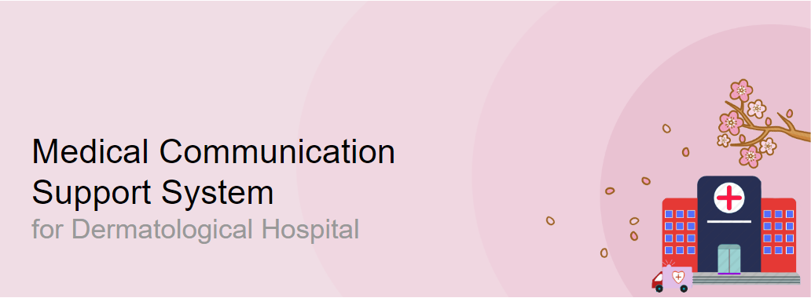
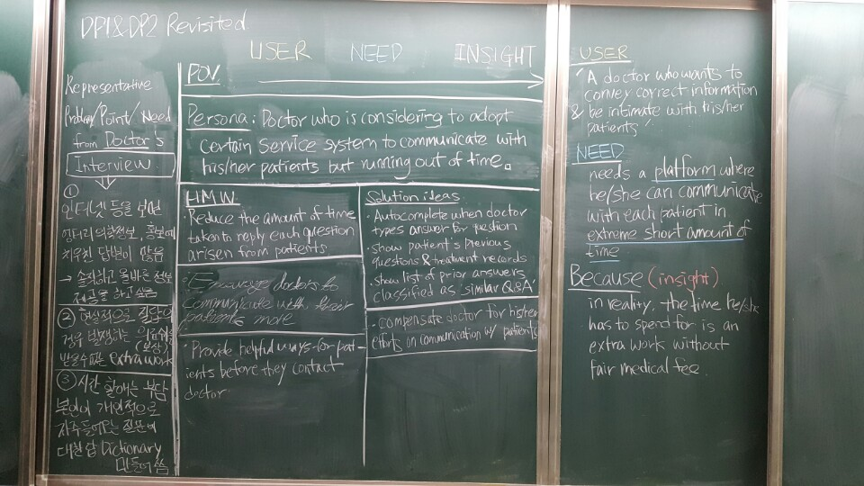

# Human Computer Interaction

### DP 2: Ideation

<div markdown="0" style="text-align:right">
	<h4>TEAM: Oh-Hack-Nyun
    	<h6>Hyeongcheol Moon\n
        	Minyeong Yang\n
        	Seunghee Yoon\n
        	Taesoo Lim</h6>
    </h4>
</div>

<div style="text-align:center" markdown="1">

</div>

#### ***[Point of View (POV)]***
Hyeongcheol's friend really cares about her skin. However, the cost for visiting dermatological hospital is excessive for each time. She might need a way to reduce costs down when visiting the dermatological. 

- User: Hyeongcheol's friend who cares much about her skin. She is 24 years old, and currently working SRT cabin crew.
- Insight: It costs significant amount, not just financial but also in time, when she visits dermatological hospital each time.
- Need: There is a need to reduce down her costs for visiting the hospital. 


<br></br>
#### ***[Personas]***


Gender: Female

Age: 20 – 40

Preference: She has a tendency to go to one certain dermatological hospital where she went before

Motivation: Patients have to wait significant amount of time and pay a tidy sum for a simple treatment or just a counselling

***Goal: Have better skin, with lower costs***

Scenario: Patient who go to a particular hospital frequently might have arisen with simple questions but actual visiting would be annoying. Instead, she uses an online system in order to ask question directly to doctor.


<br></br>
#### ***[How Might We (HMW) Question]***


- Serve something more to patients while they are treated in hospital?
- Get rid of the need of visiting hospital?
- Utilize patients’ time when they are not in hospital?
- the cost of visiting the hospital
- Make the hospital familiar so that raise up the intimacy between the hospital and the patients?
- Support financial aids for medical treatment?
- Facilitate getting information about medical treatment from somewhere else other than the hospital?
- Change a hospital into a place where people would want to go?
- Eliminate the prejudice to go to dermatological when skin gets bad?
- Reduce the time taken for visiting hospital?

From the HMW questions above, 3 HMW questions were elected within our team.

	1. Serve something more to patients while they are treated in hospital?
This HMW question proposed under the consideration of “Amplifying up the good”. Our target users would go to the hospital anyway, so it could be better to give more when they visit the hospital rather than lowering the cost

	2. Utilize patients’ time when they are not in hospital?
The second HMW question is from “Remove the bad”. As it is mentioned, there are two kinds of cost – financial and in time. Apparently, removing the economic cost is hard to remove. Hence, it would be a better idea to make effective use of patients’ time when they are not in hospital.

	3. Change a hospital into a place where people would want to go?
The last HMW question is originated from the idea of “Create an analogy from need or context”. If the hospital becomes a place where people want to go like café or lounge, then they will go there even if it costs money and time.

<br></br>
#### ***[Solution Ideas]***

Then, our team came up with more than 10 solutions for each of the HMW question. Those solutions are listed below:

```Serve something more to patients while they are treated in hospital?```

1.	Provide additional service such as massage, while patients are waiting in the hospital
2.	Offer free beverage and snacks while patients are waiting in the hospital
3.	Do not charge for counselling or checking progresses
4.	Do some basic skin examination on waiting time
5.	Furnish waiting room as a working place, with some internet connection and PCs.
6.	Construct equipment for self-measuring own skin to encourage more visiting.
7.	Conduct offline meeting for patients who got similar medical treatment to share the experience and ask question to each other.
8.	Let patients use hospital room as sleeping room after the treatment.
9.	Construct conveyer belt so that all the medical treatment is held with lying down on the belt
10.	Offer shuttle bus for the hospital
11.	Manage visiting time of frequent patients to minimize the waiting time
12.	Establish business alliance with stores nearby to provide discounts in prices.

```Utilize patients’ time when they are not in hospital?```

1.	Expand phone counselling services
2.	Operate face-to-face talk (similar with tea time?) besides the office hour?
3.	Provide online counselling through kakaotalk or other message apps
4.	Enable patients to take skin examination by video call (like skype)
5.	Establish telediagnosis system
6.	Manage online QnA board for patients
7.	Supply FAQ (frequently asked questions) in detail.
8.	Share medical progresses and treatment result with patients in order for them not to visit the hospital in those reasons
9.	Notify to patients for confirmation on the appointed day and a day before. (via message, kakaotalk, etc)
10.	Provide an online platform for community among patients

```Change a hospital into a place where people would love to go?```

1.	Run a café inside the hospital
2.	Set the hospital location as “Pokestop” for PokemonGo player
3.	Furnish books in the hospital with rental service
4.	Hire handsome employees on the information desk
5.	Advertise the hospital targeting celebrities so that make fans to come to the hospital as well
6.	Polish up doctor’s technique to become the best dermatological hospital in the country
7.	Make environment for children to play in the hospital
8.	Start coupon system
9.	Afford some complimentary cosmetics
10.	Establish a business partnerships to provide more customer service for patients
11.	Operate gym with personal heath training

<br></br>
From the solutions listed above, it was possible to select 3 solutions that got the most votes. The voting had been proceeded under condition that there is no limit in the number of choices, and the top three solutions that earned the most votes are selected. All team members would have different perspectives, so it was expected to reflect various aspect in all three solutions. These three solutions are selected.

	1. Provide online counselling through kakaotalk or other message apps
This solution is suggested from question “HMW Utilize patients’ time when they are not in hospital?”. It is possible to notice that patients often come to hospital just to report current status and get some counselling. It might presumably lower the number of visiting hospital by providing counselling via online message apps.

	2. Provide an online platform for community among patients
This solution is also proposed from the question “HMW Utilize patients’ time when they are not in hospital?”. It seems ideal solution if doctor and patients make interaction directly. It is, however, not easy to manage time during the office hour, and there are too many patients for doctor to take care of. Other patients who already have experiences of after care for certain medical treatment would be able to give some help for patients.

	3. Establish a business partnerships to provide more customer service for patients
This solution is originated from the question “HMW Change a hospital into a place where people would love to go?”. It is obvious to point out that it is not easy to reduce the price of medical treatment. If patients are available to get price discount or prizes from other stores that is allied with the hospital, patients may be encouraged to go to the hospital more.

<br></br>

#### ***[Storyboard]***

The storyboards below illustrates the scenarios for each solutions.

<div style="text-align:center" markdown="1">

<em>Provide online counselling through kakaotalk or other message apps</em>
</div>

Marge Simpson found some trouble on her skin. She immediately report her status to doctor via mobile messenger app, and she got the reply. She may found the ideal way of treating the problem without going to the hospital. That solution could possibly be visiting the hospital, though.

<div style="text-align:center" markdown="1">

<em>Provide an online platform for community among patients</em>
</div>

Marge Simpson got medical treatment recently. She might come up with some question about after care. She asked her question on the online community with the people who have the same experience with her. She would get some answers.

<div style="text-align:center" markdown="1">

<em>Establish a business partnerships to provide more customer service for patients</em>
</div>

Marge Simpson went to hospital several times. Her hospital alliance points piled up so that she was possible to get some benefit from that. 

#### ***[Studio Reflection]***
In the Studio Session held on Monday Apr 3rd, it was possible to get some feedbacks from studio mates. The feedbacks are followed below.

1. I like the topic and the solution derived from the topic, but solution of “community platform” seems vague. I wish to elaborate the particular solution to be clearer.

2. Based on the experience, going to the hospital, including dermatological hospital, infers that we already know the problem. It is almost not possible to do anything without actually visiting the hospital. What if we include more realistic situation that we need to go to hospital not for taking medical treatment?

3. Dermatological hospital costs expensive so that establishing business partnership (제휴 in Korean) seems a great solution to me. I wish to clarify the way of providing service by establishing the alliance among the stores near the hospital.


TA’s comment

```However, we got comments on our DP topic and approaches from our TA today (Apr 6th). We were suggested to have office hour with professor for discussing about our current status and clarify our topic. Furthermore, our previous work on DP1 turned out that it is enough to show we put plenty of effort on the task but it seems going toward wrong direction. Our approaches shown in DP1 suggested that our team members are not directly included in the user pool we set, however, the interview and survey results are apparently affected by us. The ideated topic is quite solution driven, and the survey results seems induced to the direction that we already planned before the survey. It is obvious to point out the needs of refactoring in this stage, so that our group decided to change our ideation topic from today.```

The picture below shows our current changes in our new Ideation process. We are planning to develop our new Ideation from here.

<div style="text-align:center" markdown="1">

<em>New Ideation</em>
</div>


