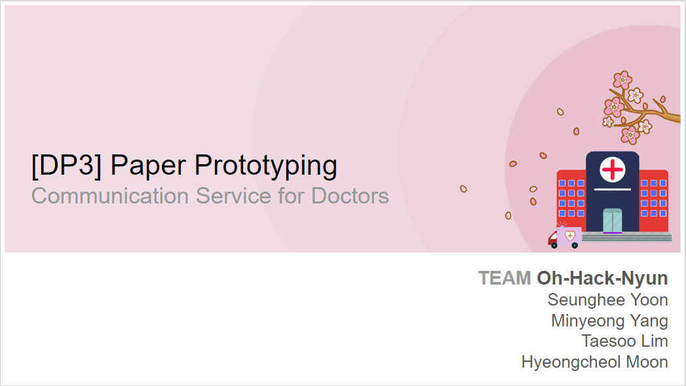

# Human Computer Interaction

### DP 3: Paper Prototyping

#### ***[Prototype]***

  
#### ***[Participants]***
participant #1
- Born in 1999, Male, recently joined to workout club in KAIST
- Exercise experience:
	- Registered gymnasium for personal training during the winter vacation for the last year of high school
	- About a month of rest, and joined to KAIST workout club
- Experience of recording workout status
	- First time after joined the club
	- Doesn’t know what to write down at the beginning
	- Just write down on paper.
	- For each workout section, record sets, reps, and amount (mostly weights)

participant #2
- Born in 1996, male, recently joined to workout club in KAIST
- Exercise experience
	- Lightly worked out 2 years ago, while leaving of absence from school
	- Doing exercise in dormitory gym in fits and starts
- Experience of recording workout status
	- First time after joined the club
	- He is using workout report template provided by the club
	- The cell size for table in the template is too small for him.

participant #3
- Born in 1994, male, chief staff for training in the workout club in KAIST
- considered as EXTREME USER
- Exercise experience
	- Has been doing exercise 6 days per week for 4.5 years.
- Experience of recording workout status
	- Has been written down all the workout report for 4 years.
	- Recently quit writing down since he felt he doesn’t need that anymore.

  
#### ***[Briefing]***

Since we had tested three Korean users, we carried out user testing with briefing and tasks written in Korean. Therefore, we leave our briefing and tasks in both Korean and English version to include the scripts that had been actually used in our actual testing.

Our team is planning to do a simple test for people who are learning exercise systematically or recording workout contents for management of personal training. This test will spend about 15 minutes, and the result will not be exposed to anywhere other than reflection on UI design. We deeply appreciate your time for this test, and are welcome to hear any positive and negative comments on the UI design for the testing.
The test that will be done now is about experiencing mobile web interface designed to reduce down the tiresomeness of writing down workout contents while doing exercise. Our team is under consideration of designing UI optimized to record workout routine and result easy and fast. Since the project is in the beginning, the user testing is not taking place with its designated environment of actual workout session, so please imagine that you are currently working out now.

Now, test begins

저희는 운동을 체계적으로 배우고 있거나 자기관리를 목적으로 본인의 운동 내역을 기록하고 계신 분들께 간단한 테스트를 진행하고자 합니다. 본 테스트의 소요 시간은 15분 내외이며, 결과에 대해 사용자 테스트 외 목적으로 사용되는 일이 없으니 안심하시고, 긴장하지 않은 상태에서 테스트에 임해주시면 됩니다. 귀중한 시간을 내주셔서 감사 드리고, 테스트를 마친 뒤에 떠오르는 생각이 있으시면 긍정적인 의견, 부정적인 의견 상관없이 자유롭게 이야기해주시면 감사 드리겠습니다.

오늘 해보실 테스트는 웨이트트레이닝 운동 중 본인의 운동 내용을 기록할 때에 번거로움을 최대한 줄여보려는 시도에서 출발한 모바일 웹 인터페이스입니다. 저희 팀은 쉽고 빠르게 복잡한 운동 루틴을 기록할 수 있는 디자인을 고민 중에 있습니다. 프로젝트 초기 단계이기 때문에 아직까지는 실제로 운동을 하면서 테스팅을 진행하지는 않습니다만, 본인이 운동을 하고 있는 중이라는 상상을 하면서 테스팅을 해주시면 감사 드리겠습니다.

그럼 테스팅을 시작하겠습니다.

  
#### ***[Tasks]***

1. Select and add exercises.
	a. Select exercises for today and add to exercise schedule.
    b. Schedules for today: body part focusing on: chest muscle, exercise: Barbell Bench Press
	c. Weight: 10 kg, reps: 10 times, 2 sets

2. For the added exercises, try editing, deleting the task, or marking them as completed
	a. Do exercise following the schedule
    b. Mark as complete if the exercise task is done, and change the task if it is stopped
    c. Try deleting all the tasks marked as completed with reset button

3. Load workout routines (workout sets which had been done before)
	a. Reload all workout sets saved before
	b. Reload exercise schedule: abdominal muscle exercise routine 1
	c. Try completing all the tasks in the reloaded schedule.

1. 운동 선택해서 추가
	A. 운동 목록 중 오늘 할 운동을 골라 운동 계획에 추가해보세요
	B. 오늘 할 운동 부위: 가슴, 오늘 할 운동 이름: Barbell Bench Press
	C. Weight: 10kg, Reps: 10 times, Sets: 2

2. 추가된 운동에 대해 운동 후 완료처리/수정 혹은 삭제 지시
	A. 계획에 맞게 운동을 진행해보세요
	B. 운동을 마무리 한 경우 완료, 중도에 멈춘 경우 내역 수정
	C. 운동 마무리 후 운동 계획들을 리셋해보세요

3. 운동 루틴들 (기존에 했던 운동들의 저장 항목들) 불러오기
	A. 기존에 저장했던 운동들에 대한 저장 항목들을 불러와보세요
	B. 불러올 운동: 복근운동 routine 1
	C. 운동 진행을 마무리 해보세요

  
#### ***[Observations]***

  
#### ***[Individual Reflections]***

Interviewee 1

- Facilitator - SH Yoon
- Computer - MY Yang
- Observer 1 - HC Moon
- Observer 2 - TS Lim

Interviewee 2

- Facilitator - TS Lim
- Computer - HC Moon
- Observer 1 - MY Yang
- Observer 2 - SH Yoon

Interviewee 3

- Facilitator - SH Yoon
- Computer - HC Moon
- Observer 1 - MY Yang

**MY Yang**

Difficulties
Computer with P1 : I was embarrassed when the user did something unintended, and the most uncomfortable thing was that I cannot talk anything when the participant tried a function we didn't implement. I felt the need to prepare error messages for actions we cannot do and to show prototype more intuitively.
Observer with P2, P3 : It was the hardest to be busy when the facilitator's speed was faster than my writing speed. And I know that observers should be quiet and just observe user's behavior, but just observing without saying was a little frustrated. But considering after test, I thought this role allocation is essential.

Pros
I was surprised at the fact that I could find problems which all four of team members didnt think of at a small cost. Because there is no target user in our team, we designed interfaces with thinking like "it wiil be convenient to use". But I learned that real users think differently from us through paper prototype testing. And we have to change most of UI from the result of prototype testing, but if we prepared the actual web interface, it would be hard to change than paper prototype.

Cons
The biggest problem seems that the paper prototype looks different from the actual devices like computer and smartphone. Our team made a mobile web interface to easily record workouts on smartphones as a paper prototype, and decided that the way to delete a record is swiping it. (and most of mobile application would use this.) But paper prototype was hard to express that affordance.
Also, simple functions such as confirm, close and select buttons were easy to make. But dynamic functions like numeric change or name change were hard to show through paper prototype. Fortunately, there were not many in our prototype, but I learned the importance of "wizard" while prototype testing.

**SH Yoon**

1st role and 3rd role – difficulty as a facilitator: Because I was the one who prepared briefing and index cards indicating each tasks, I wanted to do facilitator at the beginning and I was rather confident. Since we also conducted pilot-test right before our first tester had come, I thought I was 100% ready for the user testing. But still, I had few difficulties withstanding the pressure I had to put up with, in front of our awkward and grateful participant. Whenever he does something I have never anticipated before, I was confused. The most frequent question arisen in my mind was, ‘Should I tell him this or not?’ and ‘Until which point should I have to say?’ or ‘If I tell him something, would that be okay or helpful for this test?’. Since this was usability testing, I could not pinpoint every directions but at the same time, I had to lead him to the right walkthroughs. Therefore I always had to be extra careful for every single words what I had to say. In third user test, the words I needed to say were far more clearer than before and few of things that user misbehave were laid in my prediction range. However, our third user was kind of our extreme user who has been doing workout 6 days per week for more than four years. Besides testing, he told us a lot of things that we could not consider before. While testing, he dragged out inconvenience of our service a lot so I had to help him focus on and finish the tasks we had prepared.

2nd role – difficulty as an observer: In the second user test, we switched our role and I became an observer who definitely had to be silent enough and just focused on what user actually did. However, in my case, it was really hard for me to suppress the desire to speak. I was really surprised that it turned out that this was THAT hard. I’m not blaming, no offense, but I thought our facilitator was a bit shy as well as our second participant that it was not sufficient enough for the user to be encouraged and to be spoke up aloud. Rather than observing user’s subtle behavior (Later after the test had done, I realized that I even had to check his small facial changes and voice tones, as a good observer. Sadly I couldn’t observe that well.), I just stared at, thinking some more explanations had to be indicated for user in order to perform well and say his opinion more. To be honest, I could not keep myself shut my mouth down and started speaking right after he finished our tasks.

**HC Moon**

Computer With P2 and P3:
I was a bit embarrassed when the user acted differently than I thought when the user was taking the task.I was frustrated because I could not explain when the user pressed or wanted some functions that was not implemented yet or could not be shown due to paper prototyping limitations. When I saw users do not know what to do in doing the task, I could definitely feel that there is the lack of UI.

Observer With P1:
It was hard to record all the user's critical incidents. If the user showed a lot of unexpected behaviors in a short time, I could not write it all down. In addition, I misunderstood the intention which the user actually wants in the UI, so that I recorded the wrong information.

Pros:
I finally realized that everything that I thought was natural when this project was started was totally wrong with user interviews and user testing. Users had a lot of diversity than we thought, and through it we have found a lot of UI issues in our project. I thought that paper prototyping was done roughly by paper, but it was really amazing that such a simple prototyping could get huge output.

Cons:
The biggest disadvantage is the limitations of paper prototyping. It is hard to express even very simple things through the paper. Also, users tend to be too awkward to paper prototyping. In fact, users did not know what to expect when they first saw the prototypes presented.

**TS Lim**

1st role – difficulty as an observer
At the time when I was first introduced about the role of observer, I immediately realized that the observer carries out the most important role in the user test of paper prototyping. Facilitator and computer should pay attention to interact with participants, but the observer can solely examine and report all the speeches and behaviors in the third person’s point of view. However, observer as the roll of paper prototyping should give something more than just the observed scene. I wrote down everything examined during the user testing, but I should come up with some of my insights possibly applied to our design based on users’ behaviors and reactions. Observer is the only one who write down, so my report directly becomes the result of the user testing. I should have noticed my responsibility as the observer.

2nd role – difficulty as a facilitator
My second role was the facilitator. I simply thought my role is just to give instructions for the tasks and clues when participants are stuck and don’t know what to do. Unfortunately, after I finished my role in current user testing session, I realized that observer is my vocation for this user testing. Facilitator should provoke users’ reaction while not leading user to inappropriate or designated directions. Which means, I must talk constantly to derive conative answer from users. Unless we are testing on extreme users, it is not easy to expect direct feedback on designs. Therefore, it depends on the capability of facilitator to thrive useful and active feedbacks from users. I was devoid of this sense of affordance with words.

Pros
Paper Prototyping indeed allows designers to collect users’ feedback with low costs. Some feedbacks let us to guarantee the strength of usability of designed interface, while other feedbacks give totally unexpected aspects on the usability of designed interface. Since it is proper direction to reflect - or at least consider about - all feedbacks from users, it seems much effective and efficient to cast paper prototyping rather than impassionedly debate about adding or changing the designs of certain feature in the UI.

Cons
The most critical drawback of paper prototyping would be its limitation of being made up of paper. There need some imaginations to figure out how to carry out the given tasks, since participants are, in fact, looking at the design drawn on paper. There are several affordances on web interfaces based on experiences, especially related with touch screens, but it is not quite apparent to remind common features (such as swipe) with just looking at the paper prototyping. It might be possible to design well with reflecting the characteristics of paper, but the main purpose of paper prototyping is to use minimum resources to get users feedback so that it would be preposterous.
Another weakness of paper prototyping is that the result depends on the facilitator’s capability of provoking reactions and feedbacks from users. In fact, this holds for most of things in our life. Users never give direct feedback on design or features. Facilitator should ask and talk consistently to provoke desired feedbacks, which I don’t have enough ability on. 

  
#### ***[Studio Reflections]***

  

