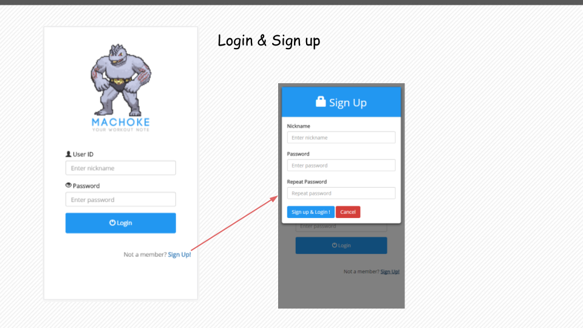
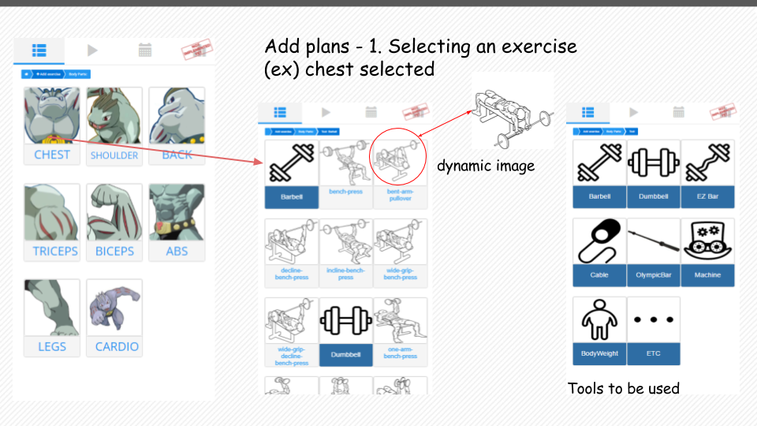
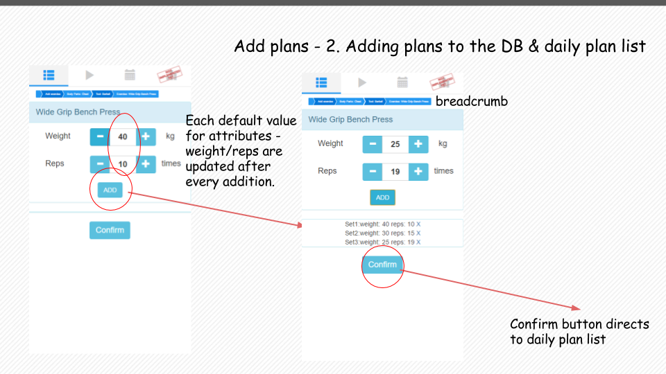
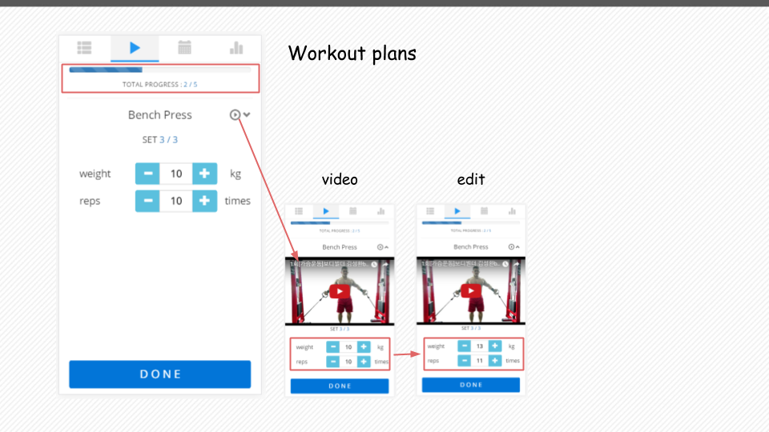
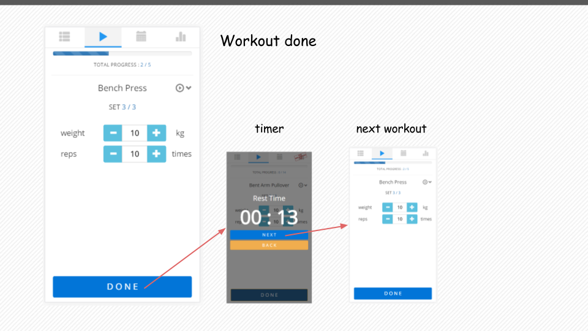
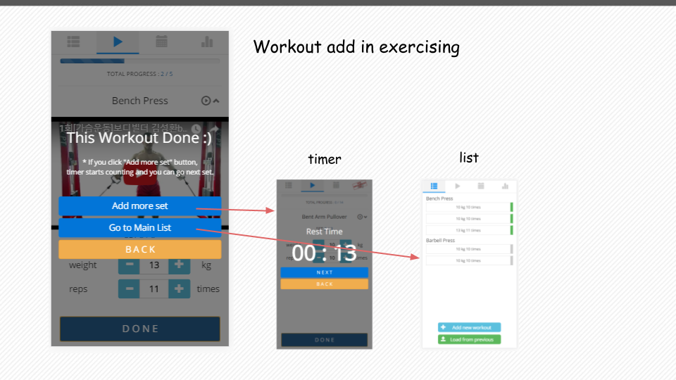
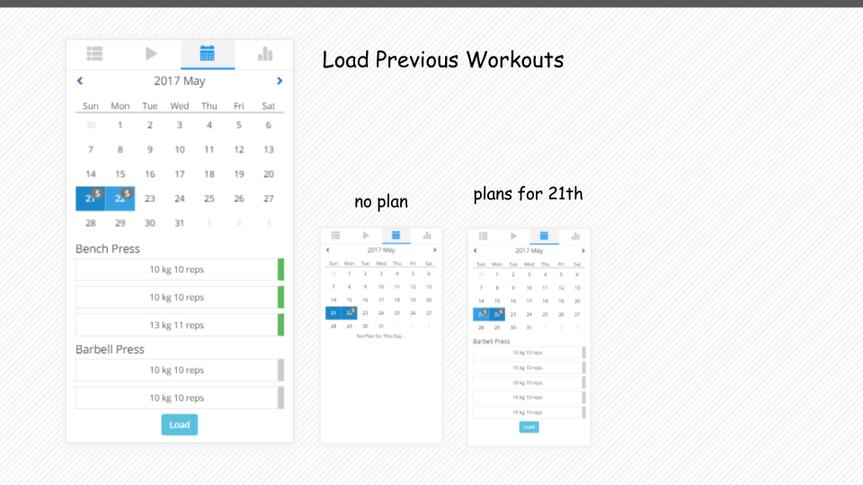

# DP6 : Hi-fi Prototyping

## POV

As it is stated in [DP3](https://github.com/shina07/cs374_HCI/blob/master/DP3/report/report.md) and [DP4](https://github.com/shina07/cs374_HCI/blob/master/DP4/report/report.md), we will focus on people who want to record their exercises while they are working out. Throughout several interviews, it was possible to note that recording of an exercise is annoying and inconvenient regardless of writing devices either papers or smartphones. These people have the needs of doing so easier and faster. The reason why it is hard to be done is because each exercise needs different attributes to record, and since these values depend on the nature of exercise, writing them down is hard to be done uniformly. Most of muscle exercises would contain weight, reps(=repetitions), sets and interval(=resting period between each set, unit=seconds), but cardio exercise or abs routine(=abdominal muscle exercise) need different attributes to record. Moreover, yet one is doing an exercise for instance, bench press, with the same number of reps and weight, intensity and stimulated muscle parts would be vary enormously depending on one’s gripping method, gripping width, bench slope and position of one’s feet. Another point we have found was, it turned out that people are actually feeling hard to name each exercise which can be a hindrance to recording. Having been considering its complexity, we need to catch at some compromising point, but with our UI, we want to face with, and deal with the difficulties the user currently has. Many issues were covered and will be dealt in the iterative process of our design.

## Target users

Our target users would be anyone who wants to keep their exercises during their workout. But we are feeling safe to narrow our target a bit, specifically to someone who has not been long starting systematic workouts. After interviewing with KAIST fitness professor SeokHee Kim and KAIST fitness club’s training manager GunHo Park, we noticed that novice users are more likely to keep their exercise records rather than exercise experts. In that point of view, we focused our system to be more friendly to users who are not knowing well about workouts.

## Tasks

Main tasks featured in our hi-fi prototype are,

1. Adding workout plans to each user’s daily workout list by navigating through body part, tool to be used and the type of exercise to be chosen as well as attributes to be set for that exercise by the user.
>**Alignment with POV**: When user wants to record an exercise, the one has to select which exercise to be done, including its attributes. Concrete description depicting the alignment was written in DP4, profoundly.
>
>**Reflected target user’s needs**: According to our inspection, users are not familiar with exercise names. Thus, we added moving thumbnail pictures for graphical aid when selecting exercises for adding plan.

2. Conducting exercises listed in daily workout list after clicking items in the planned list. It is assumed a user to use this feature while doing actual exercise.
>**Alignment with POV**: After setting up a workout plan, user would conduct the actual exercises with our service UI.
>
>**Reflected target user’s needs**: For user convenience and for reflecting user’s needs while doing an exercise, our service system shows an ‘up counter’ for user to check the interval time they have rested. It turned out that this ‘interval time’ in between sets, are crucial for many exercise recorders, our target user.

3. Loading workout routines that has been conducted and saved in our service system. Thereby, user does not have to add every single numbers and set of exercises but by clicking workouts shown in the calendar, everything would be pasted to the user’s daily workout plan list.
>**Alignment with POV**: Whenever the user adds and conducts exercise, the list for those are also been kept in our service. Adding similar set of exercises can easily be added to daily plan list for each user.
>
>**Reflected target user’s needs**: Some users stressed that they are doing similar set of exercises which has been done few days ago. We thus adopted the idea, letting users to load past plans. As a result, repetitive and rather annoying additions can be prevented.

4. Visualizing the recorded items in order for user to be encouraged, and are able to check how they are getting better.
>**Alignment with POV**: After finishing a series of tasks we’re providing, we want the user to keep recording the user’s workouts regularly. This feature is provided for encouraging the user to consistently use our service, as well as allowing them to check how they are getting better. Although we do not count it as our major task to be designed, this could be a big reason for one to record his/her workouts.
>
>**Reflected target user’s needs**: Professor SuckHee Kim, KAIST fitness professor had once told us that our service may not be useful  than using a sheet of paper if we do not support showing overall statistics and visually impressive graphs. We will do our best in addition, trying to meet the needs for those users.

5. Signing in and up so that our service system can save individual information and records privately. This task is listed at the end because it’s not considered major, but is still important.
>**Alignment with POV**: Before everything, user sign in or sign up in order to utilize our service.
>
>**Reflected target user’s needs**: Not much to be mentioned for this task, but without logging in, our service would face serious safety issues.

## Implementation Notes

### URL of prototype

To use our prototype, please click [this](https://project-oh-hack-nyun-4a19e.firebaseapp.com). We used [Firebase Hosting](https://firebase.google.com/docs/hosting) for uploading our prototype.

>URL : https://project-oh-hack-nyun-4a19e.firebaseapp.com

### URL of Git repository

To read our code, please click [this](https://github.com/shina07/cs374_HCI/tree/master/DP5).

>URL : https://github.com/shina07/cs374_HCI/tree/master/DP5

### Libraries and frameworks

we used [jQuery](https://jquery.com), [bootstrap](http://getbootstrap.com), [firebase](https://firebase.google.com), [responsive calendar](http://w3widgets.com/responsive-calendar), [highcharts](https://www.highcharts.com), [scrollify](https://projects.lukehaas.me/scrollify/#home).

### Lessons from heuristic evaluation

We received many feedbacks from [heuristic evaluation](https://docs.google.com/spreadsheets/d/1hqnocjjT2g3WJcOJRWqTdF28ysC2qcNI-DYOdAHFUoQ/edit#gid=282922788) in the class, and picked 7 important usability issues.

1. Using workout name only is difficult to know what it is. It would be better to use picture for each workout.
>We had noticed this problem from the paper prototype, but there were not enough image data in mid-fi prototype. So, we added images of body parts, workout, and video in hi-fi prototype.

2. It is hard to find what should the user do at the first page. It would be better to give an instruction for the first-comer.
>Certainly, “add” button in mid-fi prototype didn’t show what will be added if the user click it. It can be confused what this service is, and what should the user do at the first page. We changed the label of button to “Add new workout” and added “Load from previous” button.

3. I couldn’t notice that the name of each exercise is clickable. Please give the names more affordances to let users know that they could be clicked.
>There was a reason for us to make UI that way, but the arisen issue was reasonable. After receiving such suggestion, we updated our grid a bit.

4. It seems that your team gives 2-layered classification of routines. However, as there was no indicator of ‘layer’ or depth, so please use different design for different layer or include guide on this issue.
>This issue was the one we’d never thought about before. We dealt with this issue by making our body part selection grid more like the upper layer. This was modified by setting selection buttons holding pictures of Machoke, the representative character of our service. Since the selection buttons under grid in deeper layered classification directs each specific exercise to be chosen, they are now distinguishable. However, this seemed not fully solving the issue, we featured breadcrumb indicating which exercise is to be added.

5. How about adding the recommended weight and reps for each exercise?
>This had not yet been touched since we are not sure the optimal value for each exercises, but will be added in our final iteration step.

6. Is there any necessity for abbreviating repetitions to Reps?
>Reps are rather conventional term used to describe the number of times a user perform an exercise. The use of “reps” is thus our adjustment for choosing proper term that is world-widely used.

7. On adding workout plan, some cards are selectable and some are not, but they look all the same.
>Tools are actually not selectable while each exercise is. They are colored differently in order to be seen distinctive.

## Representative screenshots

## Individual Reflections

### Hyeong cheol

#### UI contribution

I made "Workout main page" placed at second tab having "play button" shape in our application. This page is for when the user is in exercising. At that time. the user doesn't need to see any other tab or click the other button except done and next button to record their workout history.

In this page, there is "Progress bar" that indicates how many set was done and remains so users can know where they are now and adjust their workload by seeing remaining the number of sets they have to do. The users can watch the "Video" corresponding with the exercise in this page. I think it is not necessary for professional users, actually it just for novice users. That is why I hide the video at default in order not to disrupt the other users. Many interviewers said that "Timer" is most important thing in exercising so I implemented this function of course. When user click "DONE" button, the timer pops up and starts to count. I added "BACK" button in timer “modal” because the user may want to go back for some reasons like changing the parameters or just clicked the done button accidently. (I explained the reason why I made the timer page to modal instead of new page below  this document. If you wonder about it, please refer to studio reflection section) Also I implemented the adding function in my page for some users who want to exercise dynamically (this means that they just record after exercising. The reason why I add this function is explained in difficulties section).

Basically because our function is for exercising and recording exercise, the information about exercise is important data. In workout main page, all of these information are so the users can see whatever they want. The page loading time somewhat long because we're using Firebase so I think we need to give the users the cue, "we are now in loading". If data is loaded successfully, then the page is painted finally. If data is empty, it will say "There is no plans". And, if information in the url is not enough to load data, you can see the error message (try this by changing the parameter in url !).

#### Difficulties

When I was making the workout main page, I recognized that there are so many different users in the world. Even for my friends, they said all differently about their habit to record workout. Some of my friend think the plans should be recorded after exercising while the others think the plans should already be prepared in gym so before exercising is better. To support these kinds of different preference, I thought about it deeply a lot. As a result, I added a "Add function" in my workout main page. This function lets the user be able to add new workout in exercising when user click done button in the last set at a workout.

Similarly, it is hard to lead the user in direction  correctly to use our application. There are too many exceptions when users travel our application. Indeed, in order to prevent the user from using incorrect way, I changed the UI of doing workout. At first our workout main page has list of exercises and the user can check the checkbox if user did one set. But after I thought about what the user want to do with our application in actually exercising, I became to know that the users don't have to know all exercise in time when they exercise. They just want to know what they do now and what status they are in. So I made a new workout main page (second tab in our application) while retaining existing workout list page (first tab) to handle the user into the correct way by only permitting to manipulate one set.

Lastly, I cannot reduce the page loading time because our application use Firebase for database and hosting service. It takes too much time to load data from Firebase. So I'm worried that the user might be uncomfortable using our application so the UX becomes bad.

#### Implementation skill

In doing this project, first, I have learned to make web application responsive. From now on, I never developed mobile targeting web application. In mobile, we cannot utilize mouse interface. It is really annoying. I have known finally the importance of the mouse. Because in typical web application mouse gives some useful information to users, implementing it in mobile is too much difficult. To deal with this, I have to find another way to give to user some information without using mouse like adding icons or highlighting clickable region.

Lastly, in fact, I'm going to develope the fourth tab in our application which shows the visualized graph of user data. In this tab, I want "snap scroll" function so I use external library "Scrollify". But in mobile, scroll acts differently to web using mouse so I had to change default mobile scroll event for making it scrollable smoothly. Finally I understood the logic about mobile scroll. By making mobile web application, I can know the difference between mobile and computer.

### Seung hee

#### UI contribution

- Grid which to select body parts
- Classification of each exercises, into body parts and tools.
- Grid which to select which tool to be used and which exercise to be selected.
- Clickable thumbnail image for each exercise that are indicating how performer should take movement for each exercise.
- Page for setting attributes and adding to workout list for each exercise
- Dynamically changing default value for attributes weight, reps - this should be reflected by reviewing the first set for each exercise.
- Breadcrumb indicating which exercise is to be added, which depth is user currently navigating, in adding task.
- Sign in & sign up page, modal and their functions

#### Difficulties

I assumed the part for user to add one’s workout plan, exercises and attributes for each exercise. This adding task had once been possessing a notable problem, that most users are not familiar with the ‘exercise-name’ that they should record. I seriously agonized over this issue for a long time, reconstructing whole page more than a few times.  At first, I considered a plane list-view page after selecting a body part, but that could never solve the issue if user does not have certainty with the name of one’s exercise. In short, I needed any kind of indicator which offers user to choose exercise easily. At last, ‘Literally dynamic 2D graphics for each exercise with movements shown when click’ has been adopted after deliberation. However, despite I had been thinking a lot for improving the adding-workout task, the grid feature still possessed many user interface issues, according to other students and TA. One issue arisen from studio was that user would like to click each thumbnail image of exercise, not its name on the footer. Well, I also thought this before, but in the same time, I wanted to provide feasible movements featured in the thumbnail image for user to know which exercise is which. Since hovering effect cannot work in our mobile-view web page, click was the one and only option for me to feature such action. This ‘mobile-view’ limitation made me difficult to feature multiple functions in one div. Moreover, the number of different exercises was overwhelming. There are thousands of exercises that needed to be classified in certain way and the classification as well as collecting all the graphic pictures for them were really hard to me to figure out.

Using firebase on javascript has many convenient features such as on & once functions but it required me to carefully set up execution orders and callback functions. Because I intensively used database reference a lot in order to add one’s exercise, and the workout-add task had to be done before every other tasks, I had to design how the database in firebase looked like.

#### Implementation skill

For implementing our service system, I learned almost every components a web contains broadly, especially for mobile view pages. The crucial thing I have harvested was the fact that I now can use bootstrap/css extensively, including fancy grids, buttons, different-colored breadcrumbs, panels, and modals(in sign up page). Specifically, I do feel satisfied with the css effect I’ve made with each exercise’s thumbnail image features. With the experience I’ve underwent, I probably can make fancy effects in the future.

### Tae soo

#### UI contribution

- Calendar in load side (responsive calendar)
- Top right badges for how many sets in the specific date
- Loading contents at the chosen date below the calendar (when it has one)
- Dynamically displaying workout list from firebase

I mainly focused on loading page. Loading feature involves loading all the workout data of current user, adding them into calendar with the right date, rendering the workouts of selected date, and load whole workout lists for selected date to the main page.

Most of my concerns about loading page were related to UI. Our first plan about “Loading” was originally to let people add their customized routines and load what they already made. However, our team thought about the necessity of loading what user had done before afterward. Thus, I considered about the how UI should be placed to display both previous records and user-made records. Eventually, we decided not to include “create workout set” feature, instead, user can load workout list from specific date. This is when our current UI layout has been decided.

Key feature of UI in loading page is definitely the calendar. For efficiency, only the date that contains some workout lists are labeled in blue. In addition, I put the badges on right top of each date to notify how many exercise sets are there. Calendar should be large enough to avoid fat-finger effect when user clicks it, and workout list preview should be provided for user to choose which date to load. Each chosen date should be labeled differently as well.

Rest of UI consideration was pretty simple, since calendar is about half of current UI. Load button should not be scrolled for efficiency of usability. It seems trivial to mention that the calendar should show current month and focus for on loading page should be the same as today by default. 

#### Difficulties

There were also some difficulties in displaying UI in as now. In the beginning, I was thinking about dynamic loading of workout lists for each month, but there were some technical difficulties of firebase feature and calendar event callback, so I just load all the data when the page is under loading. This causes inevitable delay in loading.

In UI level, it seemed to be better to fix the position of calendar and load button, and let the preview division to be scrollable. However, separation between html scrollable division and fixed division came to the difficulties in the front-end implementation. Unfortunately, it was not successful to fully implement the page by the initial design, and our current layout is to let whole page to be scrollable. I am still working on fixing this into the way to fulfill our initial design.
There were some technical difficulties related to the characteristics of mobile web page. Our web GUI is primarily assuming that all users are using our web GUI with mobile devices, but our implementation development was on PC. The library I used for displaying calendar was based on PC web page, so its event callback was based on PC event. This library has click event callback and hover event callback, but it does not support the feature of notifying which button has been clicked. The clicked cell in the calendar does not maintain the color change when we move off the cursor. Fortunately, this issue is solved by using the difference about hover event in mobile and PC. When we click in mobile, both hover and click event take place, so it was possible to add the feature of maintaining the color change of clicked button in my calendar.

#### Implementation skill

It was definitely unique experience to implement web based GUI without any backend and hosting. Common features of web application became obstacles and our team encountered plenty of unthought-of difficulties. Since I worked on “load page”, one of my main concern was the communication on the page shift. Our main page should distinguish current user from all the users in the firebase and keep workout list for today. It also support “loading” previous workouts and “adding” onto that loaded workout list. This implies the necessity of arguments passing through each pages, since we don’t have session or backend server. In this condition, I came up with one of the most key technique in our web application: implementing login by mocking ‘HTTP GET’ method.

Our firebase database has unique number for each user, and we define that number as userId. When user tries to log in our web GUI, we get that unique userId from firebase and pass it to the main page. This userId acts exactly the same role as primary key for user database in real web backend. From this point, our web GUI passes all arguments via url, such as date. This implementation skills let our team to develop well-working Hi-Fi prototype without any backend server.

### Min yeong

#### UI contribution

- **Logo image and title** We decided our service name to "Machoke", a character from Pokemon. And I downloaded its animated image(.gif), and made logo.
- **Header** In mid-fi prototype, we had few functions like add and show list. But we made calendar, statistics after, so I changed our header design for convenience. Our main functions are viewing today's plans, changing their states into "done", and adding or loading. I thought that they are all important and they should be runned in parallel. So I made the header into 'tap' design like kakaotalk.
- **Loading message** Reading firebase data was quite slow. It took about 2 or more seconds, so I thought we need to show loading message while reading data. Once the page is loaded, 'Loading' message appears, and after all the data are read, this message disappears. If there are no plan today, 'There is no plan today' message appears instead.
- **List of plans** I edited [main.html](https://github.com/shina07/cs374_HCI/blob/master/DP5/main.html), which is shown after login. There should be the list of workout plans today, and each plan should shows its detail but minimizse it. I first devided each plan into exercise name and set, so aligned sets with exercise name. A set contains detail values and the state like done or undone. For minimizing, the state is substituted with green or gray color, and the detail values are shown without tag, only with unit.
- **Add / Load buttons"** There was a feedback that it is hard to find what should the user do at the first page from heuristic evaluation. Label of 'add' button in mid-fi prototype was 'Plus', and he/she might be confused what this button do. So I changed this label into 'Add new workout' and also added 'Load from previous' button. Also, I changed their position attributes into 'fixed' then they always located at the bottom of the main screen.

#### Difficulties

It was the most difficult to unify the design concept of all team members. We wrote the code without thinking about internal consistency like service color or layout at first. Then there was a problem that each page is looked too different. So we tried to match design concept, but it was too late to edit all the code. From this, I learned the importance of UI prototype. If we had made final version of service without considering consistency, it would be more critical problem.

Also, using firebase is too difficult to use. Certainly, its usage is easy to learn but making database instruction was hard and reading time was very slow. Our service needs two main database, user and plan. But they are subordinate relationship, so it was annoying whether to put plan into user or put user id into each plan. Slow reading time was an another problem. Because javascript runs multiple lines of code at the same time, slow reading time caused a problem in the code execution order. I used many callback function to solve this, but then code became longer and longer.

#### Implementation skill

We had difficulty to maintain current data like login session and recent plan because we were not allowed to use server. So we maintained these values through URL. After the user log in, login page hand on the user id info to main page. Then, main page should give informations including user id, date, recent plan, etc to other pages. To do this, I first parsed URL and got user id value, and after all of the database are loaded, attached values to href attribute of a tags. It was a little hard coded but simple way without server.

## Studio Reflections

You can go [here](https://docs.google.com/document/d/1Ti5ADdcaYSER7k4I_McWusfxXzvpgzDOh0VF05OcKIg/edit) and read DP6 feedbacks.

1. Some buttons are too small to click. (Especially in add page)
>We are going to edit interface of 'add' page to make buttons more intuitive to

2. The function to change the order of workouts seems to need.
>We planned the function to delete but didn't think of the function to change. We will add it soon.

3. In the rest mode, buttons are too close.
>We added interval between them.

4. To give alert when the rest time is too long might be good.
>We think the alert might be somewhat annoying to our users, so we just changed the color of timer.

5. It is hard to count the weight or reps up by just one.
>We already know about that problem, so we added +5 and -5 buttons to support to count up largely.

6. When user select the date in calendar, cannot know which date is selected.
>Color of selected date is different from others, it is light blue when others are blue. But if you didn’t recognize this, we will change the color of selected date into other color. Also, we will change the color of today into another color, then there will be three types of color.

7. Cannot delete the workout sets which have been created.
>We planned that users can delete a plan by swiping it in paper prototype, but we didn’t develop yet. We will add deletion soon.

8. When done, does it need the rest time timer on the upper layer of the last 'done' set?
>User may click the done button by fault or want to know the current workout information like name, set number or progress. It is why we made timer page to modal and added back button.