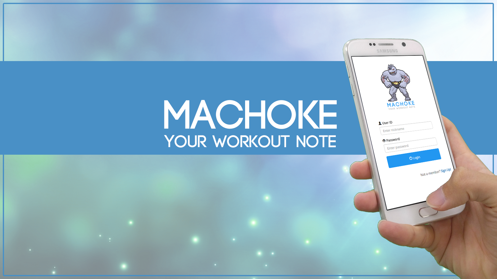
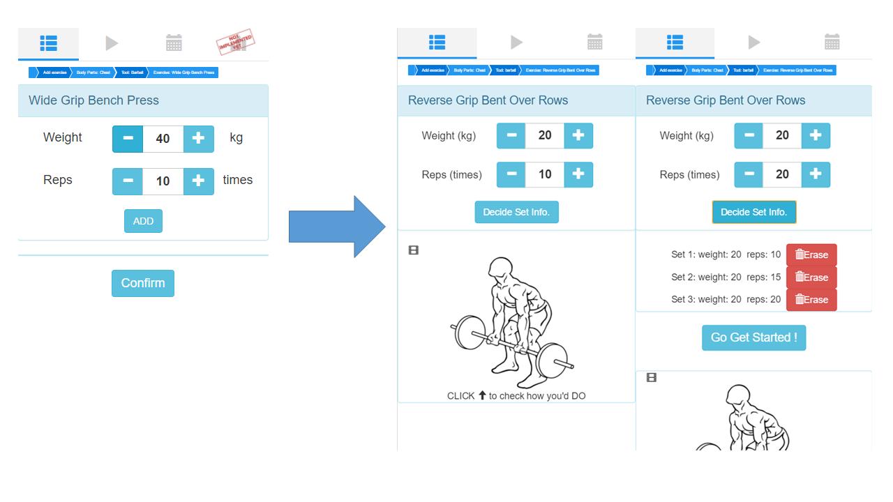
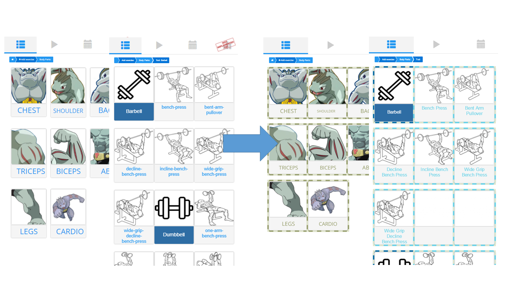
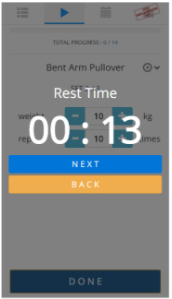
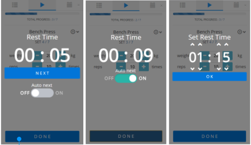
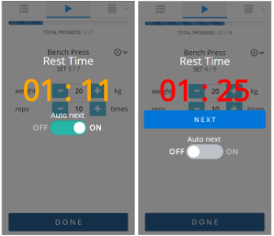
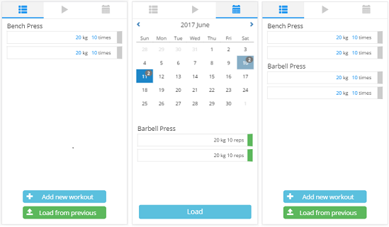

# DP8 : Iteration & Wrap-up

## Iteration

### Changes in UI

##### Under “Adding workout” task

Until DP6 Hi-Fi prototype, things in this part had been working fine but possessed some usability issues. Notable thing has revealed from every testers in DP7 User Testing that they suffered in the page for adding set information for multiple sets. Without explicit notification, testers actually didn’t move onto the next page, where user can use while doing actual workout. The problem was touched by reconsidering the instruction on each button. We initially used ‘Add’ and ‘Confirm’ button for adding another set plan, and sending those sets of exercise to the workout list, respectively. In the previous phase, Add/Confirm scheme was the fanciest way we could think of, but is modified by changing ‘wording’ for the buttons, and hide the confirming button if set information has not yet been made. Also, the enlarged animatable picture for the exercise is placed under.

Adding an exercise is done by first, selecting one of body part, and then selecting one of exercise under each tool. This two step selection is featured using grid. However, the grid itself in the previous step was not fancy enough and also possessed some issues. Each grid cell consisted of panel-body and panel-footer which holds picture in the panel-body and exercise name in the panel-footer. Because the one who made this part, proudly generated an animation whenever user clicks on the image, indicating how user should do the exercise. The problem was, people agreed that it’s good to show the animated movement, but it’s odd that it’s not clickable. (User has to click exercise-name rather than the picture at that moment) This issue was solved by changing the image also clickable and show the animatable image on the next page. Change has improved by allowing good information scent.

Another issue for the selectable grid for the exercise was the fact that it was hard to distinguish the cell for tools and cells for exercises. Although the background color of panel-footer was different, it was problematic that preceding exercises and subsequent tool are placed in the same line. This was solved, and showed that those exercises are under a consistent hierarchy.

Last but not least, design for the grid in selecting body part and selecting exercises were rather plain back then. Thus the striped border line for each cell was adopted. When it is clicked, they show that they are clicked by changing their stripe pattern, by giving a low level feedback for the user. Also, all grids in our service has the same striped pattern border lines so that we are retaining internal consistency.

##### Under “Doing workout” task

There are several feedback for rest mode screen from user testing. The issue mostly said from user is the function that automatically go to next set of exercise without clicking ‘NEXT’ button. The previous timer is count-up timer. User just looks the time and if he or she thinks to go pass the set, user has to click ‘NEXT’ button. The reason why we planed the timer function in this way was that for some novice users it is hard to know the adequate time to rest for each exercise so even if they don’t know exact rest time they have right to know the time when they went to next. But for the professional user, this is not problem anymore. They know the proper rest time and are able to set all the rest time. Another feedback which gave inspiration is the existence of ‘BACK’ button. Back button had occupied big region without any reason so we deleted the ‘BACK’ button and replaced it just ‘X’ button at upper right in modal. The following capture is the previous one.

The others picture are what we implemented newly. As you can see, we added the ON/OFF button in order to let users choose the mode automatically or manually going to next. The default mode is auto-next mode and default rest time is 1 minute. You can toggle on/off auto-next mode. When you off the auto next mode, ‘NEXT’ button appears. You should manually click ‘NEXT’ button to go to next set. If you on the auto next mode again, you should set the rest time as you want.

Also, if the remaining time is not enough, for example 5 seconds before the rest time, the color of time will be changed to orange. And if the time is over, the color becomes red. Of course the red color is only shown in not auto  next mode because time can’t be over in auto next mode.

##### Under “Loading Workouts” task

From User testing, there was one critical feedback on loading feature. Our initial implementation of loading was to overwrite existing workouts of current date by the workout lists from the selected date. This was under assumption that people might use loading before starting exercise. There was obvious and definite usability issues of this way of implementation, and we decide to change this.

The implementation is changed in the way of appending, not overwriting. Hence, users can now freely use loading feature before adding workouts, in between adding workouts, or even after done some workouts.
Furthermore, there was minor bug fixed in this iteration. Throughout the whole implementation phases from DP5 to DP7, we didn’t notice the fact that all loaded workouts should be reset to incomplete when we loaded certain workouts. That was finally fixed in the last step of DP. This is also illustrated in the picture above.

 

### Consideration of Novice Users

In DP7 User Testing, we tested three people who records their workout or had recorded in the past so we can still say that they were our target user, but all three of them were more like an exercise expert who has been doing exercise for more than three years. Yet we justified a lot why we tested rather expert users in DP7 report, we tried to seek for users who are less professional.

 

### Limitation & Future Plans

We believe that our team has successfully redesigned simple, but hard to be touched point of view for one who wants to record information about their conducted workouts. However, we still have some unsolved issues in spite of our series of efforts on design projects. Those are not yet been implemented because we decided that they are not under our scope or because we could not solve without sports professionals’ help. One thing is that we didn’t implement the part for showing one’s statistics or visualized graphs about the workouts he or she has done. We think this is important if our service is a complete product to be released but we decided not to touch it since they are surely out of our scope. Another thing is that we couldn’t feature suggestions for each user as a guideline how they would/should make routines for their exercise in order to be effective and efficient. Since we are not an expert training manager, we were cautious on making those so.

 

## Individual Reflection

### Hyeong cheol

In our application, I've developed the entire second tab which includes the current set information that the user should know when they are doing workout such as progress bar, set orders, name of exercise and exercise video for novice user. These basic informations are so important to users but it was so hard to put all of these informations to just one screen. In addition to the basic information, I've implemented rest timer UI which can let the user need not to use their own timer or look the watch in health club. Two UI are the core point in our POV because it is impossible to do and record the workout without these.

The most difficult thing I'd encountered is to adjust what information should be allocated at which regions. Now I think that this consideration is what we've learned in this class and eventually leads interactions of human and computer to be better. Thereby so as to give users perfect feeling about how to use our application without any descriptions, I've considered so much things and so longer for even thing that seems trivial. As a result in this way, our team argued a lot whether focusing to make functions is correct or focusing to make UI better is for our improvement. These discussions was helpful for next project step. We've learned at every steps and been able to make a decision more speedy at next step. However, we consumed too much time to discuss and in fact we went through a hard time as you know. In needs finding step, we misunderstood the meaning of UI. First we thought the entire picture of what we would implement and then took the user interview and survey in order to verify we were right to go. Even at Ideation step we could realize the core point of UI. Actually this is the goal of this class. Before this class, I thought UI is to make application just beautiful to see. But in going through project, I could get realized that UI is not just to make application beautiful rather but to make the interaction of human and computer easier.

By the way, since there are some limitations such as no server and no usual database, some functions I wanted to implement were not in our application. If thinking differently, I implemented awesome application even though there is no server. That is, if we would have enough time then we would make perfect application I think. If there will be any opportunities I can do new UI/UX project, I think I would be able to do better than now from what I've experienced in our project.

 

### Seung hee

Under the scope of our design project, I took the part which enables user to set up the plan, adding exercises for his/her workout including a number of different exercises, with a number of different attributes. Yet, they were still working, each page possessed more than one unsolved usability issue after conducting the user testing. Those remained issues and solutions made in Iteration for “adding workout” were described detailedly in the Iteration: Changes in UI section above. Explicitly, regarding works and changes for that task are made solely by me. To be specific, grids for choosing body part, choosing exercise, and classification (structure) for each exercise (body part -> tool -> exercise), breadcrumb, more than a few hundreds of animatable images, and sign in/up page with modal in the beginning are things I’ve contributed.

Now it’s time for me to write more about how our team has walked through. As you all know, our team suffered a lot at the beginning. While eating a pack of chicken, four of us had an all-night conference whether we should drop the course or not after we were announced to be ranked as the lowest team for DP1 and DP2. After a huge talk, we decided not to drop course, but continue with indomitable spirit. But yes, we were unhappy. We could not stick to pov that was evaluated awfully. Misfortunes never comes singly, we tried to change our subject but every time we changed it, we faced trouble keeping up doing that. At that moment, finishing up DP3 was the toughest hurdle to our team since we had to make up DP1 ~ DP3 only within 2 days, but yet we couldn’t fix on a better pov.

Although things weren’t going well, our team had not disappointed, and didn’t abandon ourselves for the projects. All four of us strongly felt a good sense of responsibility towards our design project. We did love our service, and we do believe that we made such an awesome UI, where our target users would take a fancy to figure out how our UI would do for doing their exercises. During this semester, we thought about our UI and its potential problems, issues, feasible improvements all the time. While commuting, while navigating web pages, while using our smartphone apps, we seeked to observe whether there’s any design that can be adopted to our UI. Furthermore, we were pretty good at dividing our roles and sharing our duties in efficient way. Each of us had different strengths, that synthetically composed our team, powerful enough to sort things out. What I can guarantee to speak, is that we wouldn’t make it if any one of us was missing. It was possibly done since we worked selectively, separately but collaboratively. Each of us did what one can do well with passion, and that was it. What we have done, was a magic. Actually, I was the one who didn’t believe a power of a teamwork but rather preferred to work alone, but I have changed my mind after conducting teamwork in cs374 project. Now I do believe the possibility of a team, which now I think is, boundless.

Personally, I was not a man be fond of doing workout before. But I have gone to KAIST sports complex gym four times a week after we decided to proceed the project with recording exercise stuff, wanting to be an actual user who understands how conditions are being done. What I have learned about user-centered design is the fact that it is literally hard. Once you are not familiar with the item or situation, you cannot even understand what real user say, comment, or complain. Users do speak but they are omitting a lot of things that are too trivial with their sense and their context. Thus I think it’s really thus important to be familiarize with the context as I have done, and until reaching to become familiar, you need to iterate more and more. The repetitive process requires endeavor, but that’s the fastest, plus one and only way to be able to grasp user’s intent. That’s what I have learned. About implementation, I had done a lot of UI design, actually in Iteration step, but it didn’t take long since it was really clear what I should and should not do at that moment. Series of considerations and iterations, made me confident on making something, so what I can say is that it’s important to think deeply about the user and its usage before progressing. Heavy deliberation also affects an implementation to be more efficient.

 

### Tae soo

###### What part of the UI implementation did you contribute to?

> (...)

###### What worked well and not in your team? How did you overcome any hurdle in teamwork? What lesson about teamwork did you learn that you might apply to your next team project?

> (...)

###### Throughout the team-based design project experience, what did you learn about the user-centered design process and web-based GUI implementation?

> (...)

 

### Min yeong

###### What part of the UI implementation did you contribute to?

> I have taken on the part of main screen, which is shown after logging in. In main screen, the users can check the list of workouts and start exercising by tapping a plan. The most important things are “how can show the list clearly” and “how can induce the users to find what they should do”. The first one is related to efficiency. Needed informations for each set are detail of plan and whether the user have done it. At first, there was workout name in each set, but I learned that most of users do several sets per one workout, so I put weights, repetitions, and completion in one plan. Whether the user did a workout is shown as color, green or gray.
>
> Making affordances for who visits our UI first has changed many times. There were only our service name and back button in the header at first. Then our participants didn’t know what they can do in this page, and what this page does. So I changed the header into tabbed dialogs. Tabbed dialogs let the user know what this page is, and the user can move other key pages easily. Making ‘add’ and ‘load’ buttons notable is also a design for who visits our UI first. These buttons are always fixed at the bottom of main screen, and I had changed their color and size many times so that the users can easily find the existence of the buttons.
>
> I also made consistency for our whole UI. I collected the sketches our members drawed, and made UI blueprints with photoshop, which includes approximate size of each element and color.

###### What worked well and not in your team? How did you overcome any hurdle in teamwork? What lesson about teamwork did you learn that you might apply to your next team project?

> It was not easy since we should select our subject. We had a discussion about the subject, and picked a service for doctors to interact with patients at first. But this subject had a lot of problems. Our point of view was not clear, and it was too difficult to do user testing. So we decided to change our subject from DP3. When four people talk to each other, it is easy to get two to two opinions, and we did. Because of this, it was long and tedious, but no plausible outputs until prototyping.
>
> However, from the paper prototyping, we could see the path. Each of us had own area of interest, so we made sure of our role sharing. Because I was interested in design (not like HCI but just artistic design), I was responsible for the part of design and making presentation. I think that role sharing is very important in team projects. Until this, all of we tried to convince each other, but after role sharing, we respected the opinion of the member taking part. Above this, because everyone should be responsible for his part, the results got better.
>
> Since we started programming, there were many problems for consistency. I thought there is no need to maintain consistency because we will make a short project, but soon after, we could not read each other’s codes at all. I learned how important it is to unify style of coding and design concepts in team projects.

###### Throughout the team-based design project experience, what did you learn about the user-centered design process and web-based GUI implementation?

> I remember a restriction when I choose a subject. “You should not be one of your target users.” I think this is one of the most important thing for this course. If our target users include me, my vision would have narrowed as I designed our service as I thought. However, for the objectives of this course, we always made what our users want while excluding our opinions. Thanks to that, our subject became narrower and the goal became clearer. Until we decided on a subject, I thought ‘Do they really need this?’ but every time the participants say ‘This is nice. I will use this service well.’, I was encouraged. Also, having to manage the exercise plans on a set basis and timer for break time between sets are functions we didn’t think of at first.
>
> I have never made anything on the web, but the most impressive thing is that the design I think is actually quite different from what I see. I wrote the code while imagining the result, but there was different view on the browser. (Also it even looked different on mobile.) To solve this, it was helpful to refer to existing UIs. Looking at the code of well designed mobile websites, I selected proper value of css like border and shadow. I also think minimalism is so important thing. At first I tried to include as many details as possible on the page, but I deleted most of them if our participants didn’t use at all.
>
> I can not write more about it, but it was a really different experience and I learned a lot!